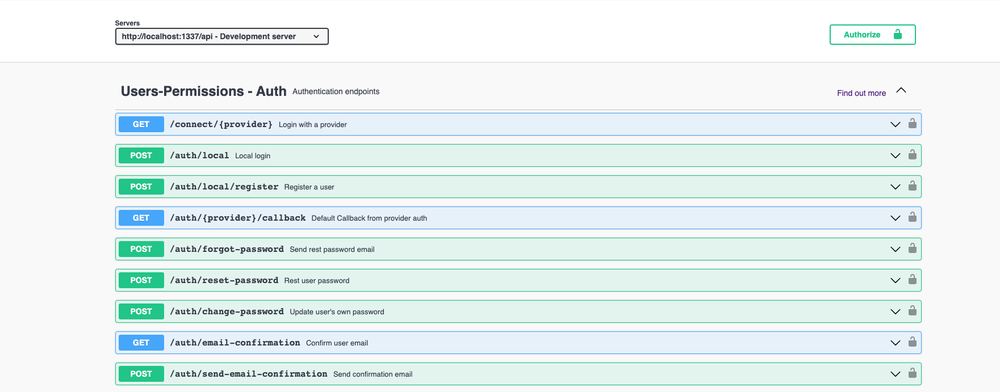

# Backend Landing page Andrystylist

This is a page designed so you can register, log in, retrieve your password by sending an email, and you can also see the services that Andrystylist offers. It is built with an open source headless CMS (Content Management System) based on Node.js.

**Technologies Used**
**Node.js:** Node.js is a runtime environment that allows us to run JavaScript on the server-side. It's the foundation of our backend.

**Strapi:** Strapi is an open source headless CMS (Content Management System) based on Node.js. A headless CMS is a CMS that separates the backend from the frontend.

**JSON Web Tokens (JWT):** JWTs are used for user authentication. When a user logs in, a JWT is generated and sent to the client, which is then included in subsequent requests to authenticate the user.

**Cloudinary:** Cloudinary is a cloud-based image and video management platform that allows developers to optimize, deliver and transform images and videos quickly and easily.

**Api Documentation swagger**
Swagger is a set of open source tools for designing, building, documenting and using RESTful web services.

## Database
El backend utiliza PostgreSQL como base de datos para almacenar información del usuario, datos de servicios y productos.

## Deployment
The backend is deployed on Render, a cloud hosting service, to make it accessible to the frontend and users.

## Prerequisites 📋

- [Git](https://git-scm.com/downloads)
- [Node.js and npm](https://nodejs.org) Node >= 18.15 LTS.

## Installation 🔧

   1. Clone the repository: https://github.com/anstylist/andrystylist-bed

   2. cd andrystylist-bed

   2. Run npm install or yarn to install server dependencies.

# initial configuration

Before starting the project you must provide the required information in a .env file that must be created in the root of the project directory

```sh
HOST=0.0.0.0
PORT=1337
APP_KEYS=kkk
API_TOKEN_SALT=kkk
ADMIN_JWT_SECRET=kkk
TRANSFER_TOKEN_SALT=kkk
JWT_SECRET=kkk
# Database
DATABASE_CLIENT=postgres
DATABASE_FILENAME=kkk
DATABASE_HOST=localhost
DATABASE_PORT=5432
DATABASE_NAME=kkk
DATABASE_USERNAME=kkk
DATABASE_PASSWORD=kkk
# Cloudinary
CLOUDINARY_NAME=xxxx
CLOUDINARY_KEY=123456
CLOUDINARY_SECRET=xxxx
# EMAIL
EMAIL_SENDER_USERNAME=a.gmail.email
EMAIL_SENDER_PASSWORD=a gmail app password
```
# 🚀 Getting started with Strapi

Strapi comes with a full featured [Command Line Interface](https://docs.strapi.io/dev-docs/cli) (CLI) which lets you scaffold and manage your project in seconds.


### `develop`

Start your Strapi application with autoReload enabled. [Learn more](https://docs.strapi.io/dev-docs/cli#strapi-develop)

```
npm run develop
# or
yarn develop
```

### `start`

Start your Strapi application with autoReload disabled. [Learn more](https://docs.strapi.io/dev-docs/cli#strapi-start)

```
npm run start
# or
yarn start
```

### `build`

Build your admin panel. [Learn more](https://docs.strapi.io/dev-docs/cli#strapi-build)

```
npm run build
# or
yarn build
```

## API Documentation 📷
### Authentication endpoints



### login example


### example method get / brand


## ⚙️ Deployment

Strapi gives you many possible deployment options for your project including [Strapi Cloud](https://cloud.strapi.io). Browse the [deployment section of the documentation](https://docs.strapi.io/dev-docs/deployment) to find the best solution for your use case.

### Developing 🛠️

1. Clone the repository

2. Run `npm install` to install server dependencies.

3. Configure the env running `cp .env.example .env`

4. Run `npm run dev` to start the development server.

## License

This project is licensed under the [MIT](LICENSE).

## 📚 Learn more

- [Resource center](https://strapi.io/resource-center) - Strapi resource center.
- [Strapi documentation](https://docs.strapi.io) - Official Strapi documentation.
- [Strapi tutorials](https://strapi.io/tutorials) - List of tutorials made by the core team and the community.
- [Strapi blog](https://strapi.io/blog) - Official Strapi blog containing articles made by the Strapi team and the community.
- [Changelog](https://strapi.io/changelog) - Find out about the Strapi product updates, new features and general improvements.

Feel free to check out the [Strapi GitHub repository](https://github.com/strapi/strapi). Your feedback and contributions are welcome!

## ✨ Community

- [Discord](https://discord.strapi.io) - Come chat with the Strapi community including the core team.
- [Forum](https://forum.strapi.io/) - Place to discuss, ask questions and find answers, show your Strapi project and get feedback or just talk with other Community members.
- [Awesome Strapi](https://github.com/strapi/awesome-strapi) - A curated list of awesome things related to Strapi. -->

---

<sub>🤫 Psst! [Strapi is hiring](https://strapi.io/careers).</sub>

## Authors 👥✒️

- Andry Peña - (https://github.com/andrystylist)
